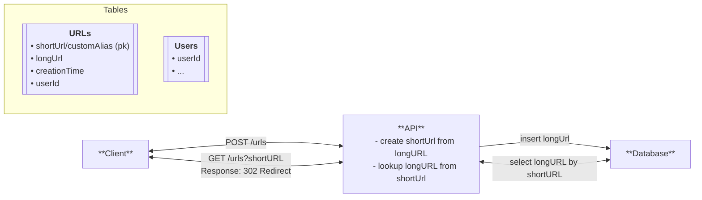

# System Design

## Overview
Design a URL shortening service that converts long URLs into shorter, manageble links.

**e.g.** https://api.example.com/v3/chat/system/logged-in?userId=789&session=abc123 =>
https://tinyrl.com/abcd-1234

## Requirements
### Functional (User can)
- Create a short url from a long url
    - optionally support custom alias
    - otionally support an expiration time.
- be redirected to the original url from the short url

### Nonfunctional (System should be)
Scalability, Latency, Fault Tolerance, CAP Theorem, Durability, Security, Collisions

- Low latency on redirects (~200 ms) *- What users percieve as real-time.*
- Scalability: 10^8 DAU | 10^9 total concurrent URL redirections
- Ensure uniqueness of shortenedUrls (avoid Collisions)
- Strong Consistency or Strong Availability
    - **Consistency:** Does every read of my system need the latest write?
        - e.g. Ticket booking ... banking application.
        - We could say no, because there isn't much downside of delaying a user's access to a urls shortly.
    - **High availability** Can we ensure high uptime?
        - We want high availability cuz we def want a redirect to work once it's made.

## Core Entities
- Original Url
- Short url
- User

## API / Interface Design
**REST**

```
// shorten a URL
POST: /urls
{
  originalUrl,
  alias?,
  expirationTime?
}

Response: 200 OK
{
  shortUrl
}
```

```
// redirection
GET /urls?shortUrl=<shortUrl>

Response: 302 Temporary Redirect
Redirection: <originalUrl>
```

## ~~Data Flow~~
N/A

## High-level Design


## Deep Dive
### Shorten URL
- fast
- unique
- short (5-7) characters

**Options**
1. n character prefix of the long url
- won't work because of collisions when visiting the same site.
2. Random Number Generator
- How large must this number be? 
  - (Must be at least between 1 and a billion based on our requirements)
  - The bigger number the less likely you will have collisions.
  - We can only have 5-7 characters, but if using numbers a billion different URLS would require 9 characters minimum ... 10^9 where each slot gives us 10^1 options.
  Collision rate: n_50% ~= 1.177*sqrt(10^9) => 37,220 **High Collision Rate!!!**
3. Base62 Encoding: 0-9, A-Z, a-z
- Allows for 62 chars per slot which would give us 62^(5-7) range.
- 1.177*root(62^7) ~= 2208754 random base 62 generations before collisions reach 50%.
  - Can be offset by reading first prior to saving new value to the database after random generation.
4. Hash the Url
- hmac-sha-256 / blake 3 are fast common modern choices.
  - hmac sha is keyed meaning the generated number is non predictable.
  - this will allow for non predictable hashes given the same hash input.
- hash functions have a waterfall effect that even a small change in input you get a very different output.
- hashFunction(longUrl) -> hashedOutput -> base62(hashedOutput)[:6]
- Has the same result as a random number at the end of the day. Still need to check db for collisions
5. Counter
- incrementing a counter -> base62
- No collisions ... always incrementing counrter to create a shortUrl
- Predictable which is bad for security.
  - Competitors will know how many urls have been shortened.
  - Will know max urls that can be shortened.
  - Can scrape all URLs
  - Offsets
    - Provide warning 
    - Rate limit
  - Bijective function
    - are functions that issue one to one mapping. (sqids.org)


### Latency
- First bottleneck DB read / write 
  - Most common db's such as postgres, sqlServer and MySql support clustered indexes on columns. Making the primary key the shortUrl gives us better than O(log(n)) lookup speed for reading data of disks. 
  - Modern servers also use SSDs giving us microsecond over millisecond response times of older HDDs.
- In addition to the keys on the database we can also add a cache using an in memory key value store.
  - we can use something like memcache, or redis being the more rich option.